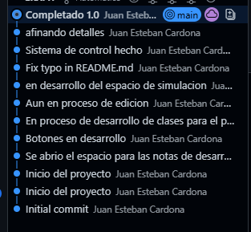
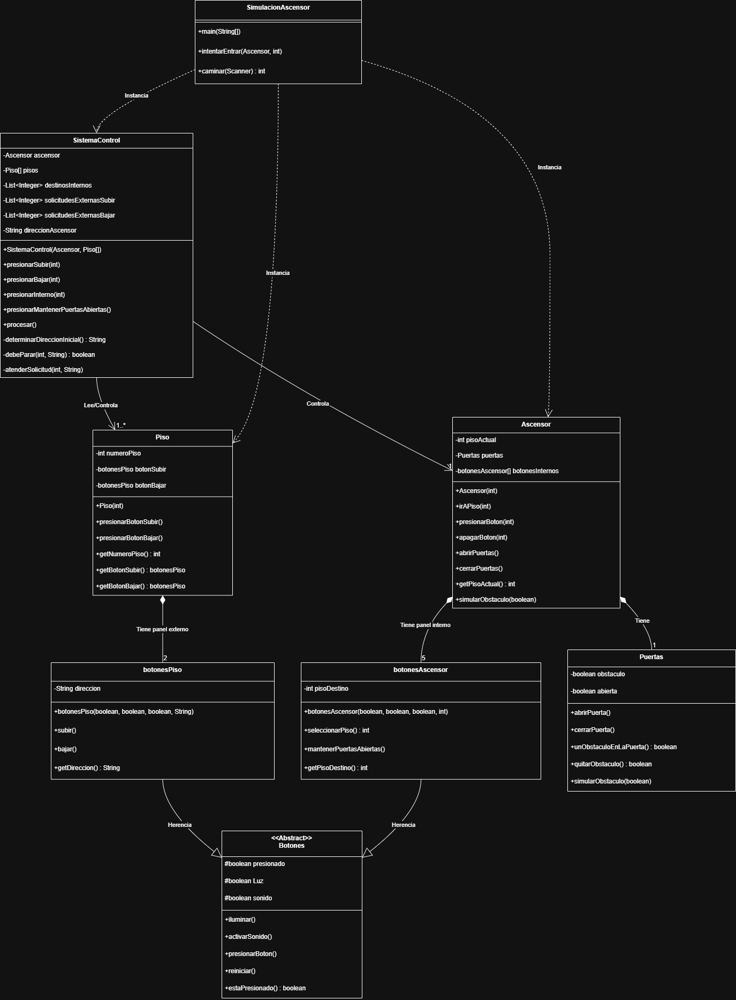
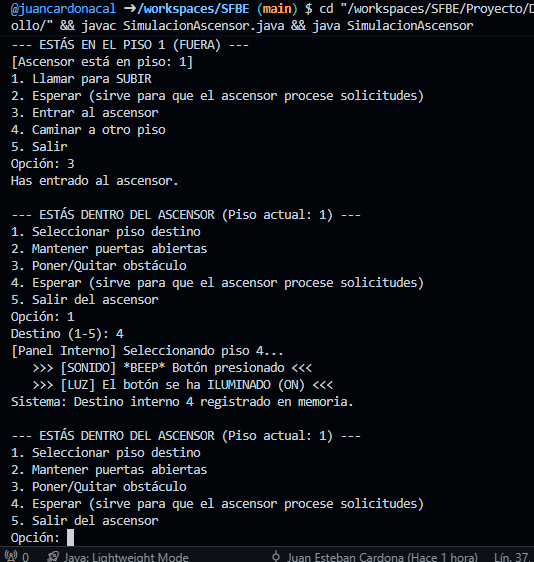
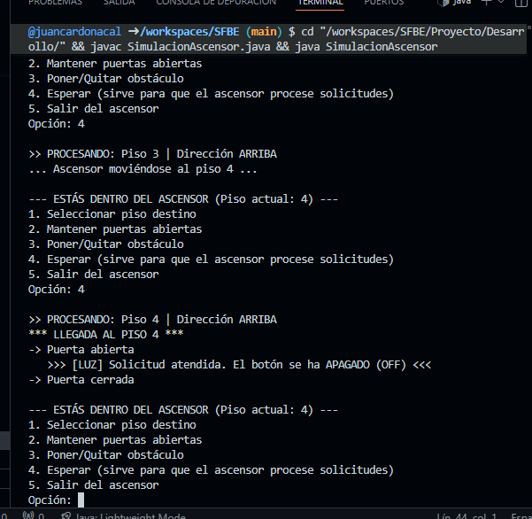
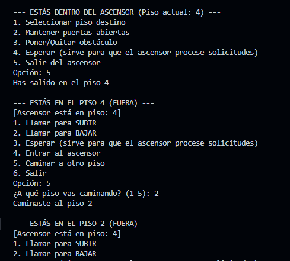
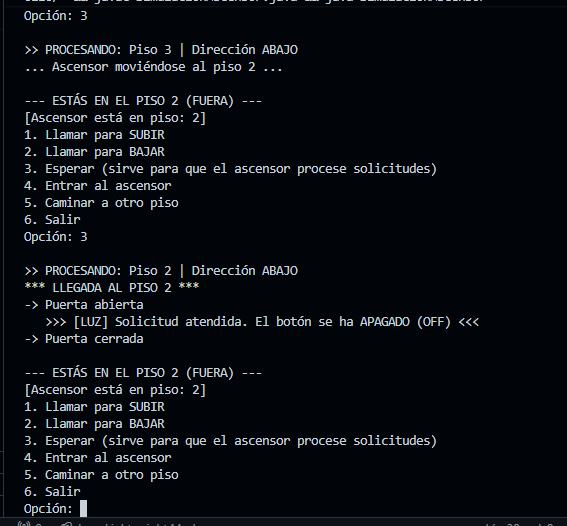

A partir de Aqui se desarrollará el taller del momento 3 de POO (programación orientada a objetos)

El proyecto de la elaboracion del ascensor segun lo que se pueda ver en los commits: 

Inicio con la respectiva revicion de la guia con la cual se procedio a elaborar las clases con sus respectivos requerimientos

Botones.java (Clase Padre) Fue de las primeras clases a programar. Lo más importante aquí fue pensar en cómo evitar repetir código. Como en la guia se solicitaba que se usara la herencia y el polimorfismo, esta fue la clase mas sencilla de implementarselo. Lo que más trabajé aquí fue la lógica para que el botón siempre avise cuando se prende y cuando se reinicia (se apaga) una vez que el ascensor llega, para que se sienta "real".

2. botonesPiso.java y botonesAscensor.java (Herencia) Estas clases fueron más sencillas porque ya heredaban todo de la clase padre, aunque claro, se buscó que tuvieran funciones propias para que el polimorfismo se hiciera evidente.

En botonesPiso: La lógica se centró en asignarles una dirección (subir o bajar), aunque en cierto punto hubo que realizarles una inspeccion pues originalmente cuando se ejecutaba el codigo de simulacion, habia un error que evitaba usarlo con comodidad.

En botonesAscensor: Aquí hubo un poco más de complejidad porque hubo que conectar estos botones con un destino específico (el piso al que queria que fuera el usuario) y añadir la funcionalidad extra de "mantener puertas", que no tienen los botones de afuera.

Puertas.java Parecía la clase más fácil, pero tuvo su truco. No se trataba solo de abrir y cerrar, sino de la seguridad. Hubo que pensar en cómo simular el sensor de obstáculos. La dificultad estuvo en asegurar que el ascensor nunca pudiera cerrar la puerta si el sensor detectaba algo, actuando como un bloqueante para el resto del sistema, aunque en general esta clase no dio mucho lio.

Piso.java Esta clase actúa más como un "contenedor". Su función principal es organizar los botones que están afuera. Lo más relevante aquí fue asegurarse de que cada piso tuviera sus propias instancias de botones y que el sistema pudiera acceder a ellos para encenderlos o apagarlos individualmente sin mezclar el piso 1 con el 5.

Ascensor.java Esta es una de las clases más robustas. Al principio no hubo mucho que meterle, pero me di cuenta de que el ascensor tiene que tener sus propios componentes adentro.

El problema fue darme cuenta de que necesitaba crear un panel de control interno (un arreglo de botones) dentro de esta clase. Fue necesario conectar la lógica física de "presionar botón" directamente aquí para que, cuando el usuario estuviera adentro, el sistema sepa exactamente que funcionalidades utilizar, las luces fueron las que mas problemas dieron.

SistemaControl.java (El Cerebro) Definitivamente, la clase más compleja y extensa del código. Aquí es donde está toda la lógica pesada.

La mayor dificultad fue gestionar las listas de solicitudes. No bastaba con ir al piso presionado; tenía que pensar en cómo hacer que el ascensor fuera eficiente (que si está subiendo, recoja a los que van subiendo).

Lógica de movimiento: Me costó bastante afinar el algoritmo para que el ascensor no se quedara "indeciso" o entrara en bucles infinitos cuando no había solicitudes claras. Tuve que ser muy cuidadoso con los condicionales para decirle cuándo cambiar de dirección y cuándo detenerse.

SimulacionAscensor.java (El Main / Menú) Aquí el enfoque fue totalmente la experiencia de usuario. Quería que se sintiera como estar ahí. Lo más complicado fue manejar los dos estados: "Estar fuera" y "Estar dentro". Tuve que crear menús dinámicos que cambian según dónde está el usuario. También fue bastante complicado validar todas las entradas para que el programa no fallara si el usuario ponía un piso que no existe o intentaba subir desde el piso 5. Fue mucho trabajo con los if/else y los bucles para que la navegación fuera fluida.

diagrama

EJECUCION

